# EaraAsmrPlayer (Android)

<p align="center">
  
</p>

> **THIS REPOSITORY AND ITS CONTENT WERE GENERATED 100% BY AI.**

Chinese version: [docs/landing_zh.md](docs/landing_zh.md)

## Overview

**EaraAsmrPlayer  (Android)** is a modern, feature-rich audio player specifically designed for ASMR content, built with **Jetpack Compose** and **Media3**. It offers a premium local library experience combined with powerful app-level features like playlist management, synchronized lyrics, background downloads, and deep customization.

*This repository is provided as-is and may be incomplete or experimental.*

---

## Sample Screens

The gallery below highlights the current library, search, collection, and playback experience using the latest UI samples.

### Library

| **Album Cards** | **Album List** |
|:---:|:---:|
| 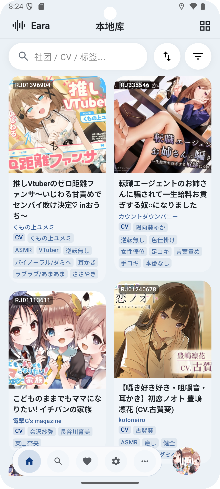 | 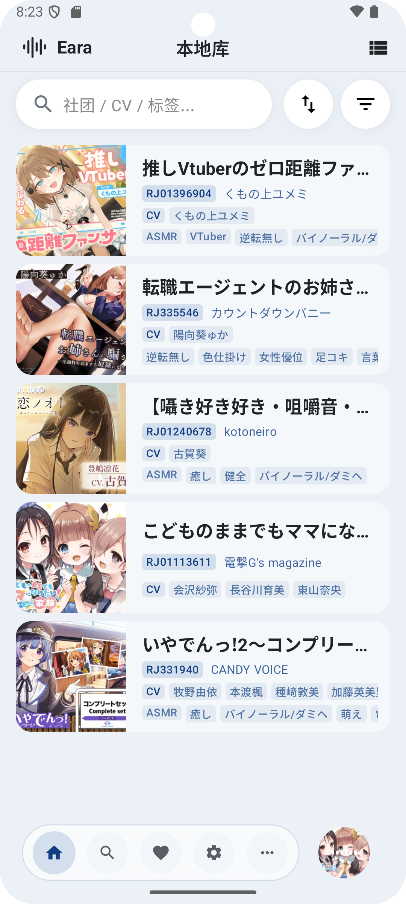 |

| **Track List** | **Dark Theme** |
|:---:|:---:|
| 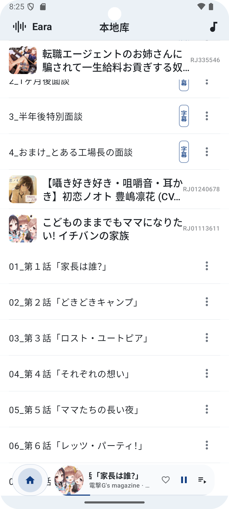 | 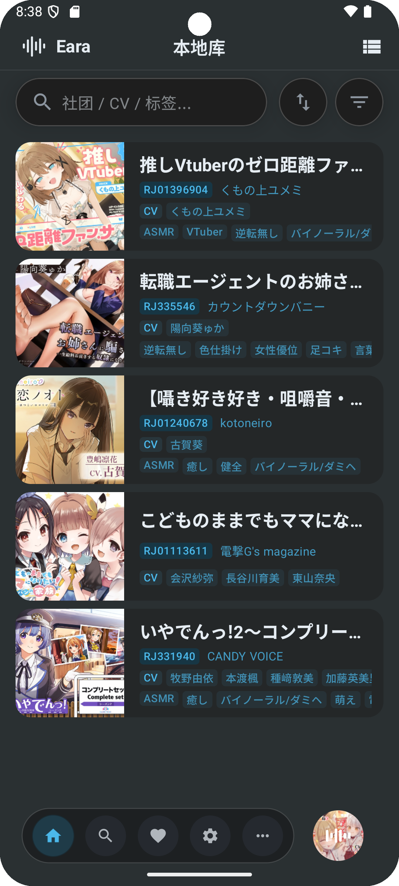 |

### Search & Sync

| **Search Cards** | **Search List** |
|:---:|:---:|
| 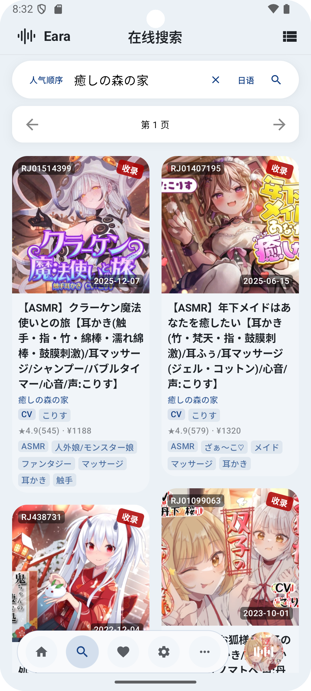 | 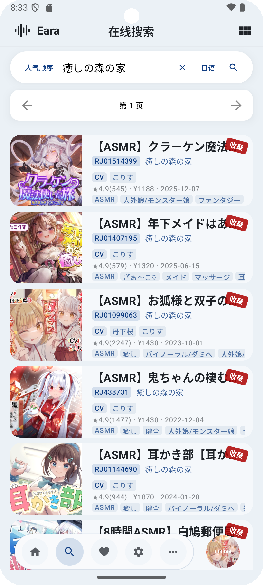 |

| **Search Dark Theme** | **Local + Cloud Sync** |
|:---:|:---:|
| 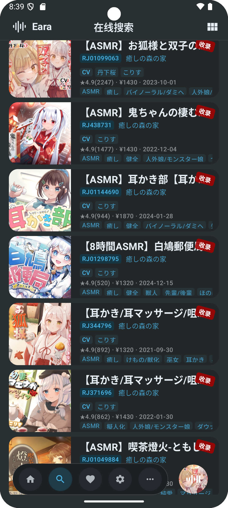 | 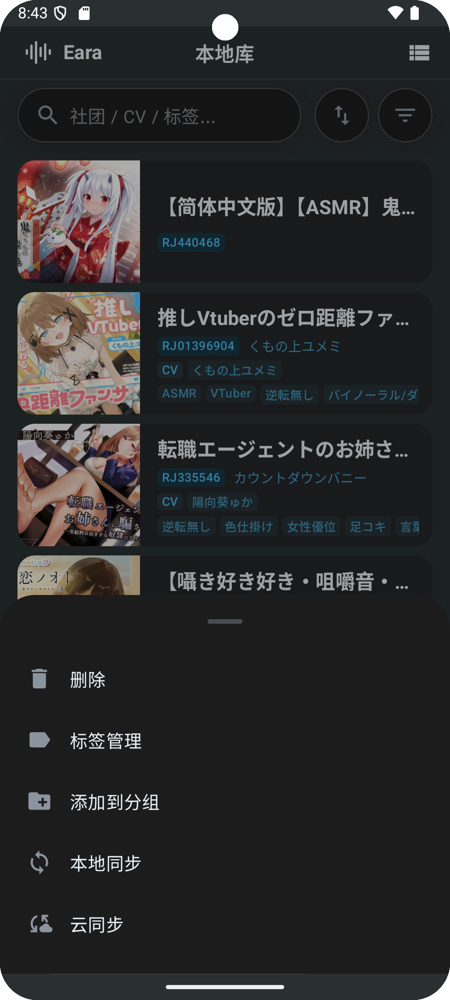 |

### Details & Collection

| **Local Album Detail** | **Online Album Detail** |
|:---:|:---:|
| 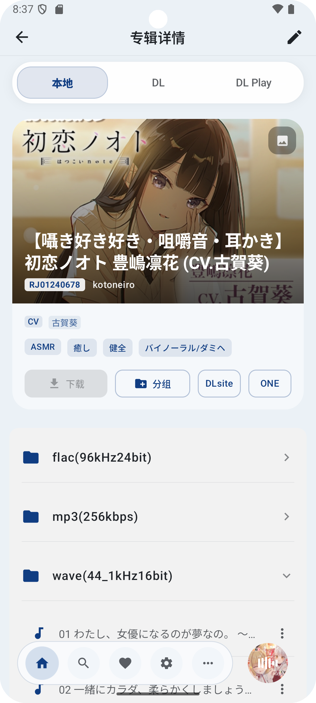 | 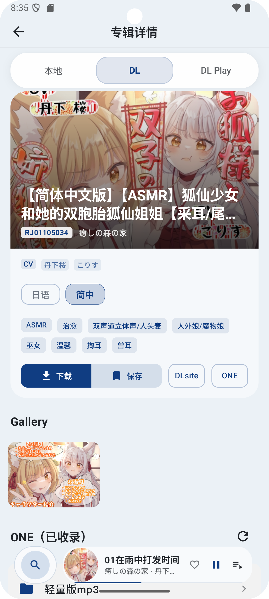 |

| **Favorites** | **Downloads** |
|:---:|:---:|
| 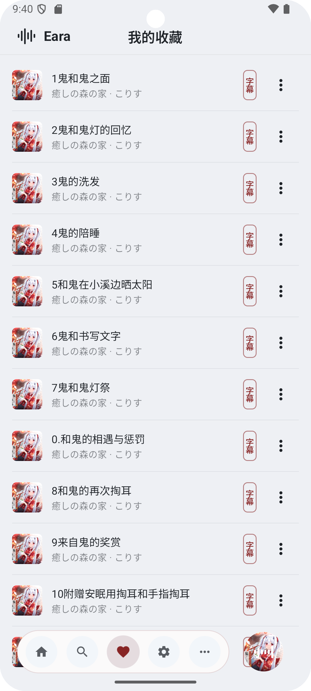 | 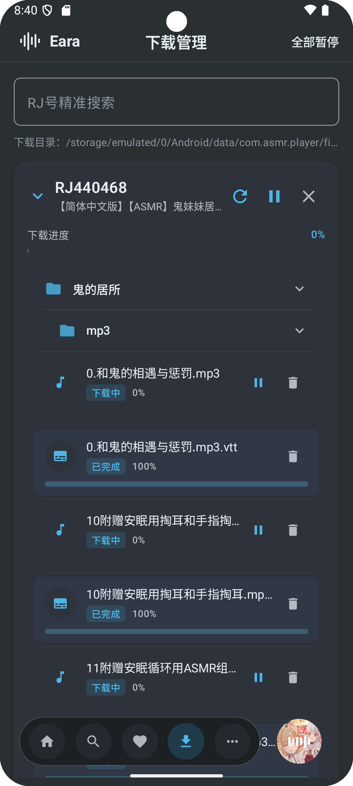 |

### Playback Experience

| **Dynamic Cover Colors** | **Transparent Player** |
|:---:|:---:|
| 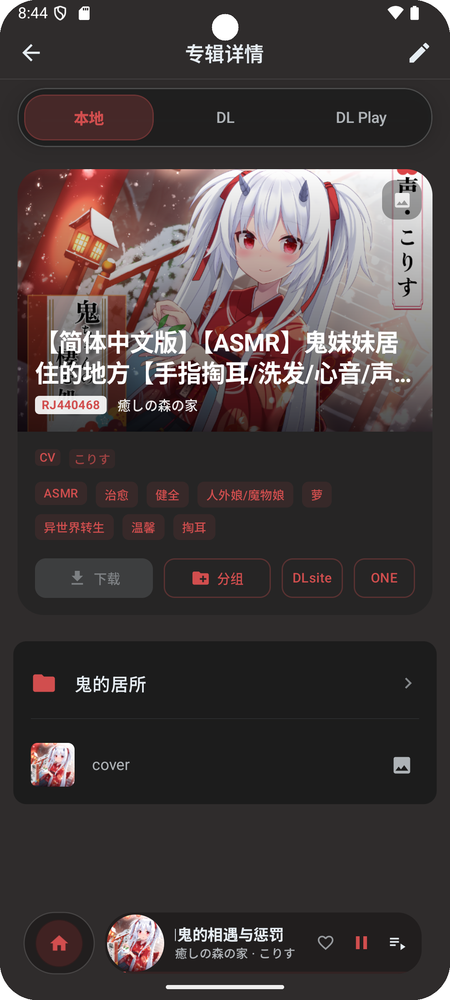 | 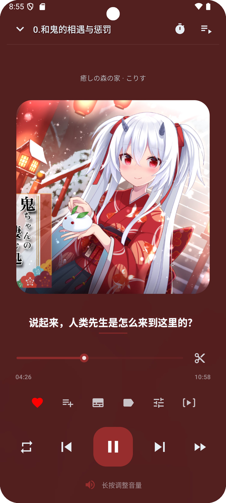 |

| **Lyrics View** | **Ambient Background** |
|:---:|:---:|
|  | 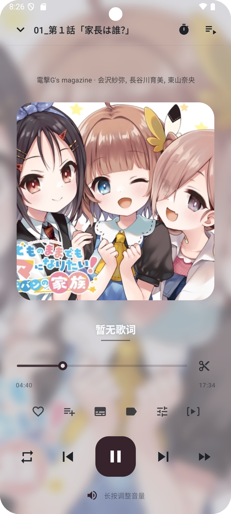 |

---

## Features

- High-fidelity playback powered by Media3 (ExoPlayer)
- Modern UI/UX with Jetpack Compose and Material 3
- Local library with album/track views, grid/list switch, fast filters and search
- Playlists and favorites for quick organization
- Synchronized lyrics (LRC/VTT/SRT) with optional floating lyrics overlay
- Headphone-focused audio effects: equalizer, reverb, gain, virtualizer, L/R balance, spatialization
- Stereo visualizer: left/right channel spectrum for binaural content
- Slice marking and A–B loop: mark segments on the seek bar, drag to fine-tune, preview slices
- Background downloads with offline persistence
- Integrated online sources: DLsite (Play library) and asmr.one
- Video playback: common formats and m3u8 streams
- Sleep timer and notification controls for background playback

---

## Downloads

- Download from **GitHub Releases** (tag `v*`, latest: `v0.2.2`).

---

## Permissions (Brief)

- **Media / Storage access**: scan and play your local audio files.
- **Notifications**: playback controls and foreground service notification.
- **Overlay (optional)**: required only when enabling floating lyrics.

---

## Content Sources (Built-in)

- **DLsite (scraping)**
- **DLsite Play library**
- **asmr.one API**

Use responsibly and comply with the laws and terms of service that apply to you.

---

## Usage Guide

- First run (local library)
  - Open Library → Add Folder, and pick your album root (document tree/external storage supported)
  - After scanning, browse albums/tracks; filter by tags, groups, or keywords
- Playback & lyrics
  - Play from album/track screens; switch to landscape for a focused session
  - Lyrics support LRC/VTT/SRT; enable Floating Lyrics in Settings (requires overlay permission)
- Audio effects
  - Open the audio panel from Now Playing: equalizer, reverb, gain, virtualizer, channel balance, spatialization
- Slices & looping
  - Enter Slice mode or long-press the seek bar to mark; drag to refine; A–B loop and quick slice preview
- Downloads & sources
  - Find resources in Search or the DLsite tab in album details; sign in to use DLsite Play purchases
  - Track progress in the Downloads screen; tasks run in the background
- Playlists & favorites
  - Create/manage playlists and favorites; organize with groups

---

## Technical Note

Kotlin + Jetpack Compose + Media3. For dependencies and versions see [app/build.gradle.kts](app/build.gradle.kts).

---

## Local Build & Install (with Profiles)

### Prerequisites

- **Android Studio**: Recent stable version recommended.
- **JDK 17**: Required by Android Gradle Plugin 8.x.
- **Android SDK**:
  - `compileSdk` / `targetSdk`: **34**
  - `minSdk`: **24**

### Open & Run

1. **Clone/Open** this project folder in Android Studio.
2. Wait for **Gradle Sync** to complete.
3. Select the `app` configuration and hit **Run** on your device or emulator.

### CLI Build & Install

```bash
./gradlew :app:installDebug
./gradlew :app:assembleRelease
```

### Baseline/Startup Profiles

- Included files:
  - Baseline Profile: [app/src/main/baseline-prof.txt](app/src/main/baseline-prof.txt)
  - Startup Profile: [app/src/main/startup-prof.txt](app/src/main/startup-prof.txt)
- Re-generate Baseline Profile (optional; requires a connected device/emulator):

```bash
./gradlew :app:assembleBenchmark
./gradlew :baselineprofile:connectedBenchmarkAndroidTest
./gradlew :app:assembleRelease
```

Collected profiles will be applied in subsequent release builds to improve startup and scroll performance.

### Build Artifacts Location

To keep your project root clean, build outputs are redirected:
- Default: `<repo>/.build_asmr_player_android/`

---

## Configuration Notes

- `local.properties` is **excluded** from version control (auto-generated by Android Studio).
- **Security**: Never commit keystores (`*.jks`, `*.keystore`) or signing secrets.
- **Networking headers**: This project separates image-loading headers from API networking to avoid cross-impact.

---

## Disclaimer

- This project is **not an official product** and is not affiliated with any platform, store, or brand referenced.
- The code may contain **bugs, incomplete implementations, or security issues**. Please review carefully before production use.
- You are responsible for complying with all applicable laws and terms of service for any third-party services accessed.
- **No warranties provided.** Use at your own risk.

---

## AI Generation Notice

This repository (including documentation and code changes) is marked as **100% AI-generated**. Human review is strongly recommended.
