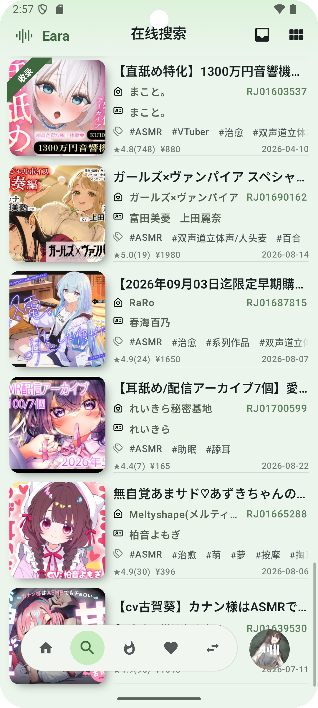
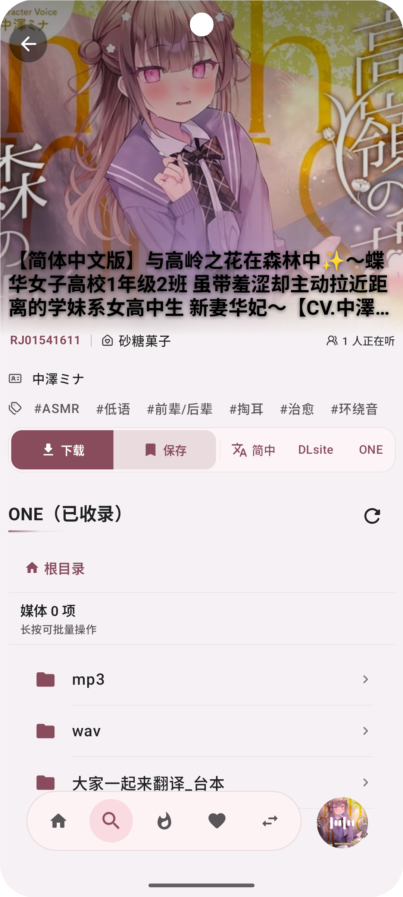
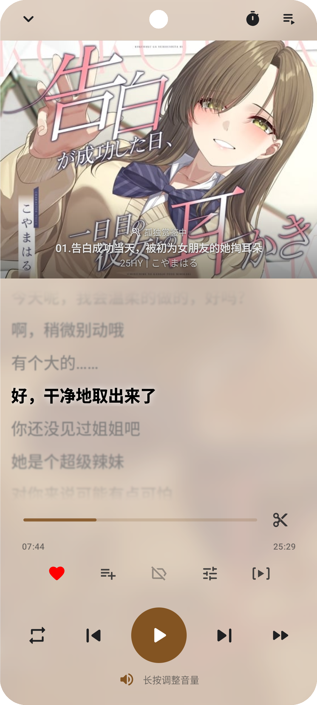
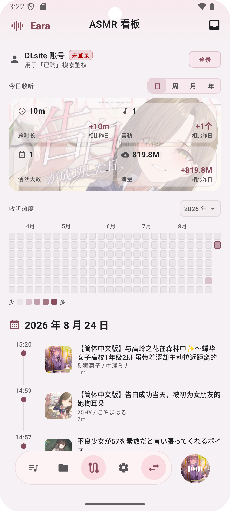
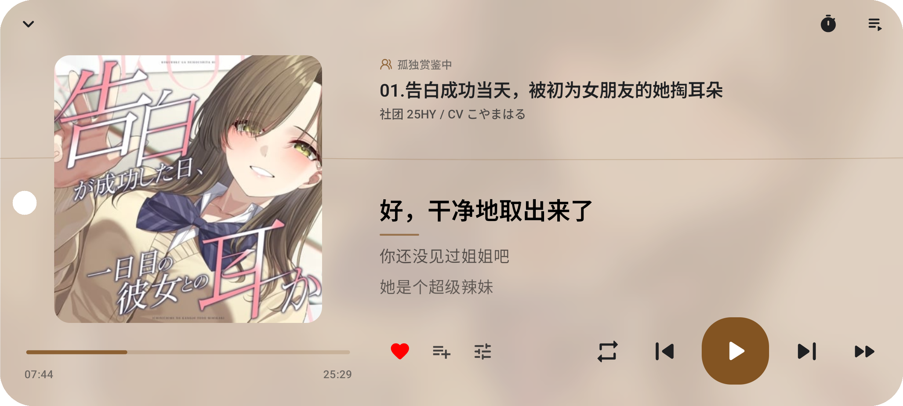
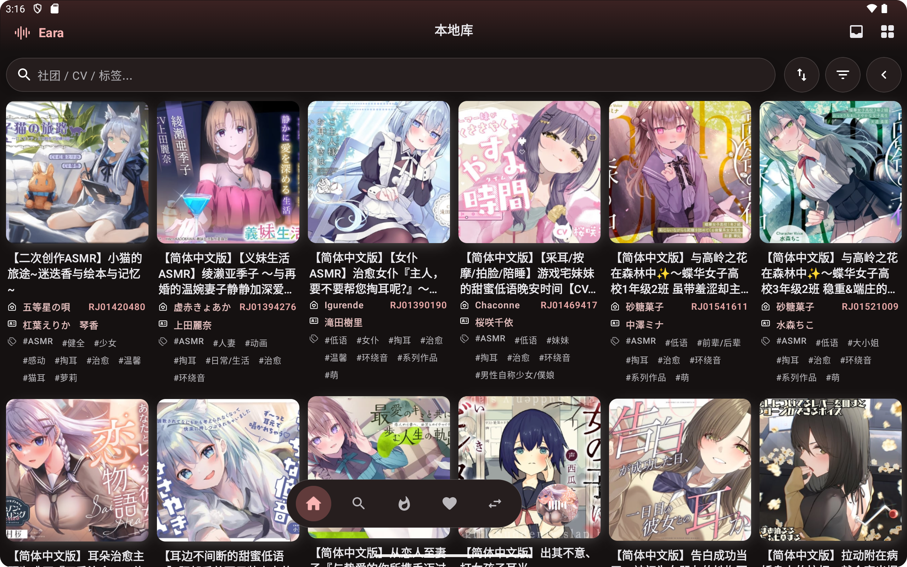
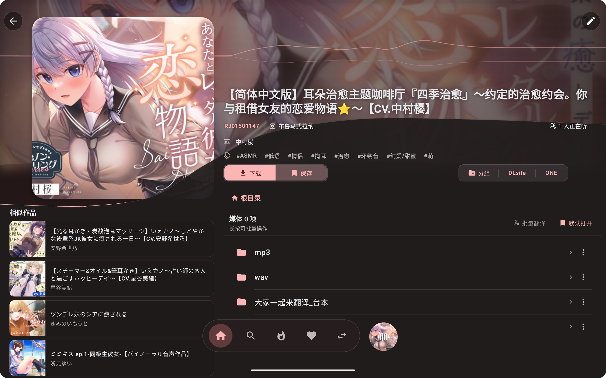
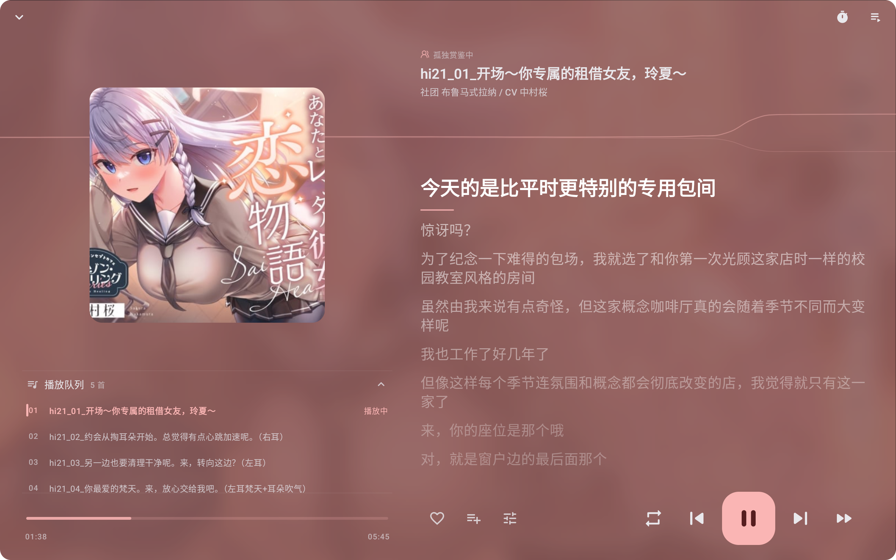

# EaraAsmrPlayer (Android)

  

> **THIS REPOSITORY AND ITS CONTENT WERE GENERATED 100% BY AI.**

## Overview

**EaraAsmrPlayer** 是一款专为 ASMR 内容打造的现代 Android 音频播放器。应用基于 **Jetpack Compose** 与 **Media3** 构建，将本地音频管理、在线作品发现、沉浸式播放、字幕处理和收听记录整合在统一体验中，并针对手机横屏与平板大屏进行了专门适配。

---

## Features

- 基于 Media3 (ExoPlayer) 的高保真音频播放
- Jetpack Compose + Material 3 构建的现代 UI
- 响应式界面：适配手机竖屏、手机横屏与平板大屏布局
- 本地音轨库管理：专辑/音轨视图、网格/列表切换、快速筛选与搜索、自定义下载目录
- 播放列表与收藏夹，支持分组整理
- 在线作品发现：支持 DLsite 与 asmr.one 搜索、收录筛选、排序和作品详情浏览
- 个性化推荐：搜索页“猜你喜欢”支持连续换一批，专辑详情支持相似作品推荐
- 同步歌词（LRC/VTT/SRT），支持独立字号调节与悬浮歌词覆盖层
- 设备端日文字幕生成与 AI 翻译，支持字幕任务管理与错误恢复
- 耳机音频效果：均衡器、混响、增益、虚拟环绕、左右声道平衡、空间化
- 双声道频谱可视化，专为双耳音频内容优化
- 切片标记与 A–B 循环：在进度条上标记片段，拖拽微调、预览切片
- 后台下载与离线持久化，支持合并已有本地作品
- ASMR 收听面板：收听时长、活跃热力图、历史时间线与热门内容
- 一起听在线人数与匿名收听统计
- 封面自动取色与深浅主题联动，支持 OLED 防烧屏像素平移保护
- 视频播放支持常见格式及 m3u8 流
- 睡眠定时器、通知栏后台播放控制与应用内版本更新

---

## Downloads

从 [**GitHub Releases**](https://github.com/eValDoll/EaraAsmrPlayer/releases) 下载最新版本（tag `v*`，当前版本：`v1.2.2`）。

---

## Sample Screens

### 手机界面

| 在线作品列表 | 专辑详情 | 沉浸式播放主页 | ASMR 收听面板 |
|:---:|:---:|:---:|:---:|
|  |  |  |  |

| 手机横屏播放 |
|:---:|
|  |

### 平板适配

| 平板本地库 | 平板专辑详情 | 平板播放主页 |
|:---:|:---:|:---:|
|  |  |  |

---

## Content Sources（内置）

- **DLsite（抓取）**
- **DLsite Play 曲库**
- **asmr.one API**

请负责任地使用，遵守适用的法律及服务条款。

---

## Disclaimer

- 本项目**非官方产品**，与任何平台、商店或品牌无关。
- 代码可能包含 **Bug、未完成实现或安全问题**。用于生产环境前请仔细审查。
- 你须自行确保遵守所有适用的第三方服务法律及条款。
- **不提供任何保证**，使用风险自负。

---

## AI Generation Notice

本仓库（包括文档和代码变更）标注为 **100% AI 生成**。强烈建议进行人工审查。
